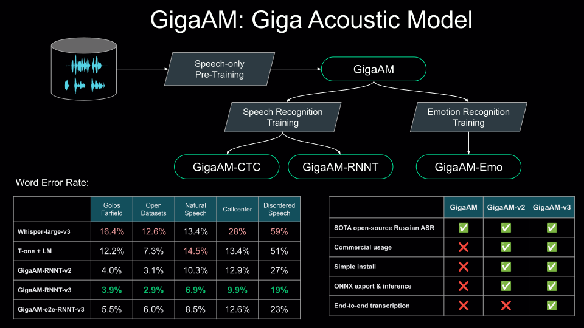

# GigaAM: the family of open-source acoustic models for speech processing

<div align="center" style="line-height: 1;">

[](./LICENSE)
[](https://www.python.org/downloads/)
[](https://arxiv.org/abs/2506.01192)
[](https://huggingface.co/ai-sage/GigaAM-v3)
[](https://colab.research.google.com/github/salute-developers/GigaAM/blob/main/colab_example.ipynb)

</div>

<hr>



## Latest News
* 2025/11 — GigaAM-v3: **30%** WER reduction on new data domains; GigaAM-v3-e2e: end-to-end transcription support (**70:30** win in Side-by-Side vs Whisper-large-v3)
* 2025/06 — Our [research paper on GigaAM](https://arxiv.org/abs/2506.01192) was accepted to InterSpeech 2025!
* 2024/12 — [MIT License](./LICENSE), GigaAM-v2 (**-15%** and **-12%** WER Reduction for CTC and RNN-T models, respectively), [ONNX export support](#onnx-export-and-inference)
* 2024/05 — GigaAM-RNNT (**-19%** WER Reduction), [long-form inference using external Voice Activity Detection](#model-inference)
* 2024/04 — GigaAM Release: GigaAM-CTC ([SoTA Speech Recognition model for the Russian language](#model-performance)), [GigaAM-Emo](#model-performance)

---

## Setup

### Requirements
- Python ≥ 3.10
- [ffmpeg](https://ffmpeg.org/) installed and added to your system's PATH

### Install the GigaAM Package

```bash
# Clone the repository
git clone https://github.com/salute-developers/GigaAM.git
cd GigaAM

# Install the package requirements
pip install -e .

# (optionally) Verify the installation:
pip install -e .[tests]
pytest -v tests/test_loading.py -m partial  # or `-m full` to test all models
```

---

## GigaAM overview

GigaAM is a [Conformer](https://arxiv.org/pdf/2005.08100.pdf)-based foundational model (220-240M parameters) pre-trained on diverse Russian speech data. It serves as the backbone for the entire GigaAM family, enabling state-of-the-art fine-tuned performance in speech recognition and emotion recognition. More information about GigaAM-v1 can be found in our [post on Habr](https://habr.com/ru/companies/sberdevices/articles/805569). We fine-tuned the GigaAM encoder for ASR using [CTC](https://www.cs.toronto.edu/~graves/icml_2006.pdf) and [RNNT](https://arxiv.org/abs/1211.3711) decoders. GigaAM family includes three lines of models

| | Pretrain Method | Pretrain (hours) | ASR (hours) | Available Versions |
| :--- | :--- | :--- | :--- | :---: |
| **v1** | [Wav2vec 2.0](https://arxiv.org/abs/2006.11477) | 50,000 | 2,000 | `v1_ssl`, `emo`, `v1_ctc`, `v1_rnnt` |
| **v2** | [HuBERT–CTC](https://arxiv.org/abs/2506.01192) | 50,000 | 2,000 | `v2_ssl`, `v2_ctc`, `v2_rnnt` |
| **v3** | HuBERT–CTC | 700,000 | 4,000 | `v3_ssl`, `v3_ctc`, `v3_rnnt`, `v3_e2e_ctc`, `v3_e2e_rnnt` |

Where `v3_e2e_ctc` and `v3_e2e_rnnt` support punctuation and text normalization.

## Model Performance

`GigaAM-v3` training incorporates new internal datasets: callcenter, music, speech with atypical characteristics, and voice messages. As a result, the models perform on average **30%** better on these new domains while maintaining the same quality as `GigaAM-v2` on public benchmarks. In end-to-end ASR comparisons of `e2e_ctc` and `e2e_rnnt` against Whisper (judged via independent LLM-as-a-Judge side-by-side) GigaAM models win by an average margin of **70:30**. Our emotion recognition model `GigaAM-Emo` outperforms existing models by **15%** Macro F1-Score.

For detailed results, see [here](./evaluation.md).

---

## Usage

### Model inference

**Note:** ASR with `.transcribe` function is applicable for audio **only up to 25 seconds**. To enable `.transcribe_longform` install the additional [pyannote.audio](https://github.com/pyannote/pyannote-audio) dependencies

<details>
<summary>Longform setup instruction</summary>

* Generate [Hugging Face API token](https://huggingface.co/docs/hub/security-tokens)
* Accept the conditions to access [pyannote/segmentation-3.0](https://huggingface.co/pyannote/segmentation-3.0) files and content

```bash
pip install -e .[longform]
# optionally run longform testing
pip install -e .[tests]
HF_TOKEN=<your hf token> pytest -v tests/test_longform.py
```
</details>

<br>


```python
import gigaam

# Load test audio
audio_path = gigaam.utils.download_short_audio()
long_audio_path = gigaam.utils.download_long_audio()

# Audio embeddings
model_name = "v3_ssl"       # Options: `v1_ssl`, `v2_ssl`, `v3_ssl`
model = gigaam.load_model(model_name)
embedding, _ = model.embed_audio(audio_path)
print(embedding)

# ASR
model_name = "v3_e2e_rnnt"  # Options: any model version with suffix `_ctc` or `_rnnt`
model = gigaam.load_model(model_name)
transcription = model.transcribe(audio_path)
print(transcription)

# and long-form ASR
import os
os.environ["HF_TOKEN"] = <HF_TOKEN with read access to "pyannote/segmentation-3.0">
utterances = model.transcribe_longform(long_audio_path)
for utt in utterances:
   transcription, (start, end) = utt["transcription"], utt["boundaries"]
   print(f"[{gigaam.format_time(start)} - {gigaam.format_time(end)}]: {transcription}")

# Multichannel transcription (diarization)
# Supports stereo/multichannel files or a list of separate files
# Results are automatically sorted by time and interleaved between channels
stereo_file = "conversation_stereo.wav"  # or list: ["channel_0.wav", "channel_1.wav"]
results = model.transcribe_multichannel(
    stereo_file,
    batch_size=4,              # batch size for processing segments
    pause_threshold=2.0,       # pause threshold for grouping segments (seconds)
    strict_limit_duration=30.0 # maximum segment duration for model (seconds)
)
for seg in results:
    channel = seg["channel"]  # channel number (0, 1, ...)
    transcription = seg["transcription"]
    start, end = seg["boundaries"]
    print(f"[{start:.2f}s - {end:.2f}s] Channel {channel}: {transcription}")

# Emotion recognition
model = gigaam.load_model("emo")
emotion2prob = model.get_probs(audio_path)
print(", ".join([f"{emotion}: {prob:.3f}" for emotion, prob in emotion2prob.items()]))
```

### Loading from Hugging Face

> **Note:** Install requirements from the [example](./colab_example.ipynb).

```python
from transformers import AutoModel

model = AutoModel.from_pretrained("ai-sage/GigaAM-v3", revision="e2e_rnnt", trust_remote_code=True)
```

### ONNX Export and Inference

> **Note:** GPU support can be enabled with `pip install onnxruntime-gpu==1.23.*` if applicable.

1. Export the model to ONNX using the `model.to_onnx` method:
   ```python
   onnx_dir = "onnx"
   model_version = "v3_ctc"  # Options: any version

   model = gigaam.load_model(model_version)
   model.to_onnx(dir_path=onnx_dir)
   ```

2. Run ONNX inference:
   ```python
   from gigaam.onnx_utils import load_onnx, infer_onnx

   sessions, model_cfg = load_onnx(onnx_dir, model_version)
   result = infer_onnx(audio_path, model_cfg, sessions)
   print(result)  # string for ctc / rnnt, np.ndarray for ssl / emo
   ```

These and more advanced (e.g. custom audio loading, batching) examples can be found in the [Colab notebook](https://colab.research.google.com/github/salute-developers/GigaAM/blob/main/colab_example.ipynb).

---

## Citation

If you use GigaAM in your research, please cite our paper:

```bibtex
@inproceedings{kutsakov25_interspeech,
  title     = {{GigaAM: Efficient Self-Supervised Learner for Speech Recognition}},
  author    = {Aleksandr Kutsakov and Alexandr Maximenko and Georgii Gospodinov and Pavel Bogomolov and Fyodor Minkin},
  year      = {2025},
  booktitle = {{Interspeech 2025}},
  pages     = {1213--1217},
  doi       = {10.21437/Interspeech.2025-1616},
  issn      = {2958-1796},
}
```

## Links

* [[arxiv] GigaAM: Efficient Self-Supervised Learner for Speech Recognition](https://arxiv.org/abs/2506.01192)
* [[habr] GigaAM-v3: открытая SOTA-модель распознавания речи на русском](https://habr.com/ru/companies/sberdevices/articles/973160/)
* [[habr] GigaAM: класс открытых моделей для обработки звучащей речи](https://habr.com/ru/companies/sberdevices/articles/805569)
* [[youtube] Как научить LLM слышать: GigaAM 🤝 GigaChat Audio](https://www.youtube.com/watch?v=O7NSH2SAwRc)
* [[youtube] GigaAM: Семейство акустических моделей для русского языка](https://youtu.be/PvZuTUnZa2Q?t=26442)
* [[youtube] Speech-only Pre-training: обучение универсального аудиоэнкодера](https://www.youtube.com/watch?v=ktO4Mx6UMNk)
