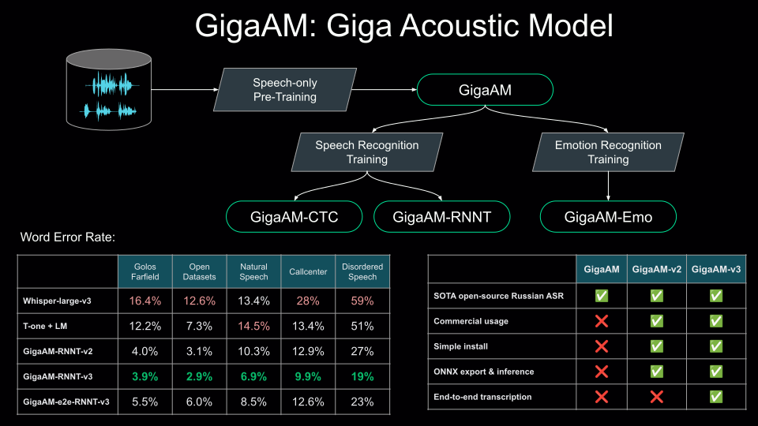

# GigaAM: семейство открытых акустических моделей для обработки речи

<div align="center" style="line-height: 1;">

[](./LICENSE)
[](https://www.python.org/downloads/)
[](https://arxiv.org/abs/2506.01192)
[](https://huggingface.co/ai-sage/GigaAM-v3)
[](https://colab.research.google.com/github/salute-developers/GigaAM/blob/main/colab_example.ipynb)

</div>

<hr>



## Последние обновления
* **2026/04** — [дообучение моделей](#дообучение-моделей) (CTC / RNNT), таймстемпы на уровне слов, [Triton Inference Server](#triton-inference-server-и-tensorrt)
* **2025/11** — GigaAM-v3: снижение WER на **30%** на новых доменах данных; GigaAM-v3-e2e: end-to-end распознавание речи (**70:30** в side-by-side сравнении против Whisper-large-v3)
* **2025/06** — Наша [научная статья о GigaAM](https://arxiv.org/abs/2506.01192) принята на InterSpeech 2025!
* **2024/12** — [MIT-лицензия](./LICENSE), GigaAM-v2 (**снижение WER на 15% и 12%** для CTC и RNN-T моделей), [поддержка экспорта в ONNX](#конвертация-в-onnx-и-использование-графа)
* **2024/05** — GigaAM-RNNT (**снижение WER на 19%**), [распознавание речи на длинных аудиозаписях с помощью внешней VAD-модели](#основные-функции)
* **2024/04** — Релиз GigaAM: GigaAM-CTC ([Лучшая открытая модель для распознавания речи на русском языке](#качество-моделей)), [GigaAM-Emo](#качество-моделей)
---

## Установка

### Требования
- Python ≥ 3.10
- [ffmpeg](https://ffmpeg.org/) установлен и добавлен в переменную PATH системы

### Установка пакета GigaAM

```bash
# Клонировать репозиторий
git clone https://github.com/salute-developers/GigaAM.git  
cd GigaAM

# Установить зависимости
pip install -e .[torch]

# (опционально) Проверить установку:
pip install -e ".[tests]"
pytest -v tests/test_loading.py -m partial  # или `-m full` для тестирования всех моделей
```

---

## Обзор GigaAM

GigaAM - фундаментальная акустическая модель на базе архитектуры [Conformer](https://arxiv.org/pdf/2005.08100.pdf) (220–240 млн параметров), предобученная на разнообразных русскоязычных данных. Она служит основой для всего семейства GigaAM и обеспечивает высокое качество при дообучении на задачи распознавания речи и распознавания эмоций. Подробнее о GigaAM-v1 можно узнать в нашей [статье на Хабре](https://habr.com/ru/companies/sberdevices/articles/805569). Для задач автоматического распознавания речи (ASR) мы дообучили энкодер GigaAM с декодерами на основе [CTC](https://www.cs.toronto.edu/~graves/icml_2006.pdf) и [RNNT](https://arxiv.org/abs/1211.3711). Семейство GigaAM включает три поколения моделей:

| | Метод предобучения | Объём предобучения (часы) | Объём данных ASR (часы) | Доступные версии |
| :--- | :--- | :--- | :--- | :---: |
| **v1** | [Wav2vec 2.0](https://arxiv.org/abs/2006.11477) | 50 000 | 2 000 | `v1_ssl`, `emo`, `v1_ctc`, `v1_rnnt` |
| **v2** | [HuBERT–CTC](https://arxiv.org/abs/2506.01192) | 50 000 | 2 000 | `v2_ssl`, `v2_ctc`, `v2_rnnt` |
| **v3** | HuBERT–CTC | 700 000 | 4 000 | `v3_ssl`, `v3_ctc`, `v3_rnnt`, `v3_e2e_ctc`, `v3_e2e_rnnt` |

Версии `v3_e2e_ctc` и `v3_e2e_rnnt` поддерживают пунктуацию и нормализацию текста.

## Качество моделей

В обучение `GigaAM-v3` были включены новые внутренние наборы данных: колл-центр, музыка, речь с атипичными характеристиками и голосовые сообщения. В результате модели в среднем демонстрируют улучшение на **30%** (по метрике WER) на новых доменах при уровне качества `GigaAM-v2` на публичных бенчмарках. В сравнении end-to-end моделей (`e2e_ctc` и `e2e_rnnt`) с Whisper (оценка проводилась с использованием внешней LLM в формате side-by-side) модели GigaAM выигрывают в соотношении **70:30**. Наша модель распознавания эмоций `GigaAM-Emo` превосходит существующие аналоги на **15%** по метрике Macro F1-Score.

С более подробными результатами можно ознакомиться [здесь](./evaluation.md).

---

## Использование

### Основные функции

**Важно:** функция `.transcribe` для ASR применима только к аудиофайлам **до 25 секунд**. Для использования `.transcribe_longform` необходимо установить дополнительные зависимости [pyannote.audio](https://github.com/pyannote/pyannote-audio).

<details>
<summary>Инструкция по настройке распознавания длинных аудио</summary>

* Сгенерируйте [токен API Hugging Face](https://huggingface.co/docs/hub/security-tokens)
* Примите условия для получения доступа к контенту [pyannote/segmentation-3.0](https://huggingface.co/pyannote/segmentation-3.0)

```bash
pip install -e ".[longform]"
# опционально: запустить тесты для длинной транскрибации
pip install -e ".[tests]"
HF_TOKEN=<ваш hf токен> pytest -v tests/test_longform.py
```
</details>

<br>


```python
import gigaam

# Загрузка тестового аудио
audio_path = gigaam.utils.download_short_audio()
long_audio_path = gigaam.utils.download_long_audio()

# Аудио-эмбеддинги
model_name = "v3_ssl"       # Варианты: `v1_ssl`, `v2_ssl`, `v3_ssl`
model = gigaam.load_model(model_name)
embedding, _ = model.embed_audio(audio_path)
print(embedding)

# Распознавание речи
model_name = "v3_e2e_rnnt"  # Варианты: любые версии с суффиксами `_ctc` или `_rnnt`
model = gigaam.load_model(model_name)
transcription = model.transcribe(audio_path)
print(transcription)

# Распознавание речи с таймстемпами на уровне слов
result = model.transcribe(audio_path, word_timestamps=True)
for word in result.words:
    print(f"  [{word.start:.2f} - {word.end:.2f}] {word.text}")

# Распознавание на длинном аудио
import os
os.environ["HF_TOKEN"] = "<HF_TOKEN с доступом на чтение к 'pyannote/segmentation-3.0'>"
result = model.transcribe_longform(long_audio_path)
for segment in result:
   print(f"[{gigaam.format_time(segment.start)} - {gigaam.format_time(segment.end)}]: {segment.text}")

# Распознавание эмоций
model = gigaam.load_model("emo")
emotion2prob = model.get_probs(audio_path)
print(", ".join([f"{emotion}: {prob:.3f}" for emotion, prob in emotion2prob.items()]))
```

### Дообучение моделей

CTC и RNNT модели можно дообучать на собственных данных с помощью PyTorch Lightning. Подробное описание всех аргументов обучения — в [`train_utils/README.md`](./train_utils/README.md). Примеры с разными ограничениями VRAM доступны в [`train_utils/example.ipynb`](./train_utils/example.ipynb).

### Загрузка из Hugging Face

> Используйте установку зависимостей из [примера](./colab_example.ipynb).

```python
from transformers import AutoModel

model = AutoModel.from_pretrained("ai-sage/GigaAM-v3", revision="e2e_rnnt", trust_remote_code=True)
```

### Конвертация в ONNX и использование графа

> **Примечание:** `to_onnx` по умолчанию экспортирует в **fp32**. Для GPU рекомендуется передать `dtype=torch.float16` — это ускоряет инференс и снижает потребление VRAM. GPU будет использоваться после удаления onnxruntime и установки `pip install onnxruntime-gpu==1.22.*`.

1. Экспорт модели в ONNX с помощью метода `model.to_onnx`:
   ```python
   onnx_dir = "onnx"
   model_version = "v3_ctc"  # Варианты: любая версия модели

   model = gigaam.load_model(model_version)
   model.to_onnx(dir_path=onnx_dir, dtype=torch.float32)  # или fp16 (рекомендовано для GPU)
   ```

2. Запуск с использованием ONNX:
   ```python
   from gigaam.onnx_utils import load_onnx, infer_onnx

   sessions, model_cfg = load_onnx(onnx_dir, model_version)
   result = infer_onnx(audio_path, model_cfg, sessions)
   print(result)  # str для ctc / rnnt версий, np.ndarray для ssl / emo
   ```

Эти и более продвинутые примеры (кастомная загрузка аудио, батчинг) доступны в [Colab notebook](https://colab.research.google.com/github/salute-developers/GigaAM/blob/main/colab_example.ipynb).

### Triton Inference Server и TensorRT

Все модели распознавания речи также можно использовать в серверном окружении в формате ONNX/TRT через Triton Inference Server. Инструкции по настройке, конвертации моделей и развёртыванию описаны в [документации Triton Inference Server](./triton_scripts/README.md).

---

## Citation

Если применяете GigaAM в своих исследованиях, используйте ссылку на нашу статью:

```bibtex
@inproceedings{kutsakov25_interspeech,
  title     = {{GigaAM: Efficient Self-Supervised Learner for Speech Recognition}},
  author    = {Aleksandr Kutsakov and Alexandr Maximenko and Georgii Gospodinov and Pavel Bogomolov and Fyodor Minkin},
  year      = {2025},
  booktitle = {{Interspeech 2025}},
  pages     = {1213--1217},
  doi       = {10.21437/Interspeech.2025-1616},
  issn      = {2958-1796},
}
```

## Ссылки
* [[arxiv] GigaAM: Efficient Self-Supervised Learner for Speech Recognition](https://arxiv.org/abs/2506.01192)
* [[habr] GigaAM-v3: открытая SOTA-модель распознавания речи на русском](https://habr.com/ru/companies/sberdevices/articles/973160/)
* [[habr] GigaAM: класс открытых моделей для обработки звучащей речи](https://habr.com/ru/companies/sberdevices/articles/805569)
* [[youtube] Как научить LLM слышать: GigaAM 🤝 GigaChat Audio](https://www.youtube.com/watch?v=O7NSH2SAwRc)
* [[youtube] GigaAM: Семейство акустических моделей для русского языка](https://youtu.be/PvZuTUnZa2Q?t=26442)
* [[youtube] Speech-only Pre-training: обучение универсального аудиоэнкодера](https://www.youtube.com/watch?v=ktO4Mx6UMNk)
