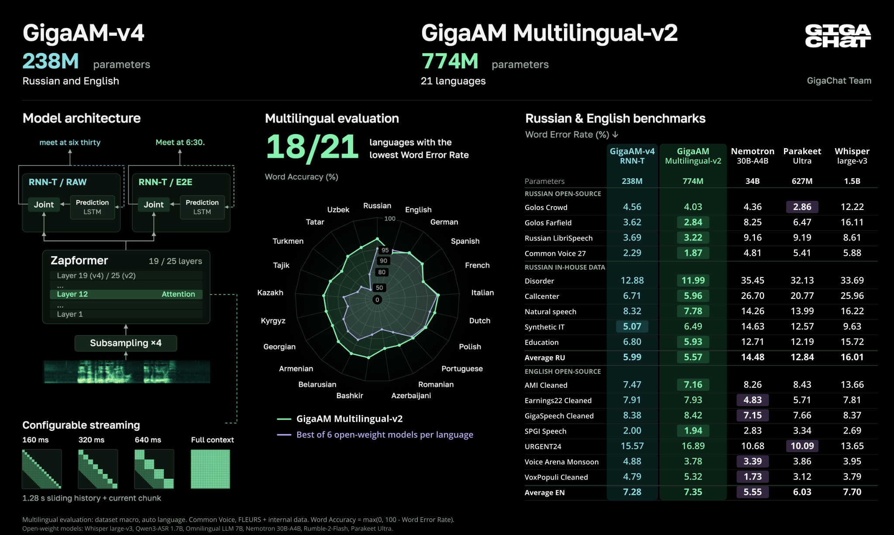

# GigaAM: семейство открытых акустических моделей для обработки речи

<div align="center" style="line-height: 1;">

[](./LICENSE)
[](https://www.python.org/downloads/)
[](https://arxiv.org/abs/2506.01192)
[](https://huggingface.co/collections/ai-sage/gigaam)
[](https://colab.research.google.com/github/salute-developers/GigaAM/blob/main/colab_example.ipynb)

</div>

<hr>



## Последние обновления
* 2026/11 — GigaAM-v4 (ru-en, превосходит Whisper-large-v3 на английском) и GigaAM-Multilingual-v2 (**21** язык, SOTA для СНГ): новая архитектура Zapformer, потоковое распознавание речи (160/320/640 мс), декодирование с двумя головами и встроенная GigaAM VAD для длинных аудиозаписей.
* 2026/06 — GigaAM Multilingual: энкодеры 220M / 600M, предобученные на **2M часов** речи на **70+ языках**; посимвольные CTC-модели ASR с лучшим WER в своем классе на русском, казахском, кыргызском и узбекском языках (умеренный результат на английском). Наша [научная статья](https://arxiv.org/abs/2607.10371) принята на InterSpeech 2026!
* 2026/04 — [дообучение моделей](#дообучение-моделей) (CTC / RNNT), таймстемпы на уровне слов, [Triton Inference Server](#triton-inference-server-и-tensorrt)
* 2025/11 — GigaAM-v3: снижение WER на **30%** в новых доменах данных; GigaAM-v3-e2e: сквозное распознавание речи (**70:30** побед в сравнении Side-by-Side с Whisper-large-v3)
* 2025/06 — Наша [научная статья о GigaAM](https://arxiv.org/abs/2506.01192) принята на InterSpeech 2025!
* 2024/12 — [лицензия MIT](./LICENSE), GigaAM-v2 (**-15%** и **-12%** WER для моделей CTC и RNN-T соответственно), [поддержка экспорта в ONNX](#экспорт-в-onnx-и-инференс)
* 2024/05 — GigaAM-RNNT (**-19%** WER), [распознавание длинных аудиозаписей с помощью внешней модели определения речевой активности](#инференс-моделей)
* 2024/04 — Релиз GigaAM: GigaAM-CTC ([лучшая модель распознавания речи на русском языке](#качество-моделей)), [GigaAM-Emo](#качество-моделей)

---

## Установка

### Требования
- Python ≥ 3.10
- [ffmpeg](https://ffmpeg.org/) установлен и добавлен в PATH системы

### Установка пакета GigaAM

```bash
# Clone the repository
git clone https://github.com/salute-developers/GigaAM.git
cd GigaAM

# Install the package requirements
pip install -e .[torch]

# (optionally) Verify the installation:
pip install -e ".[tests]"
pytest -v tests/test_loading.py -m partial  # or `-m full` to test all models
```

---

## Обзор GigaAM

GigaAM — фундаментальные модели на базе [Zapformer](https://github.com/k2-fsa/icefall/pull/2082) и [Conformer](https://arxiv.org/pdf/2005.08100.pdf) (220M–780M параметров), предобученные на объеме до 10M часов многоязычной речи. Они служат основой семейства GigaAM и обеспечивает высокое качество после дообучения для распознавания речи и эмоций. Для ASR энкодеры GigaAM дообучены с декодерами [CTC](https://www.cs.toronto.edu/~graves/icml_2006.pdf) и [RNNT](https://arxiv.org/abs/1211.3711). Семейство GigaAM включает шесть линеек моделей:

| | Метод предобучения | Предобучение (часы) | ASR (часы) | Доступные версии |
| :--- | :--- | :--- | :--- | :---: |
| **v1** | [Wav2vec 2.0](https://arxiv.org/abs/2006.11477) | 50,000 | 2,000 | `v1_ssl`, `emo`, `v1_ctc`, `v1_rnnt` |
| **v2** | [HuBERT–CTC](https://arxiv.org/abs/2506.01192) | 50,000 | 2,000 | `v2_ssl`, `v2_ctc`, `v2_rnnt` |
| **v3** | HuBERT–CTC | 700,000 | 4,000 | `v3_ssl`, `v3_ctc`, `v3_rnnt`, `v3_e2e_ctc`, `v3_e2e_rnnt` |
| **v4** | HuBERT-style | 7,000,000 | 58,000  | `v4_ssl`, `v4_ctc`, `v4_rnnt` |
| **multilingual** | HuBERT–style | 2,000,000 | 50,000 | `multilingual_ssl`, `multilingual_large_ssl`, `multilingual_ctc`, `multilingual_large_ctc` |
| **multilingual_v2** | HuBERT–style | 10,000,000 | 155,000 | `multilingual_v2_ssl`, `multilingual_v2_rnnt` |

## Качество моделей

`GigaAM-v4` превосходит `GigaAM-v3-E2E` на **35%** в русском ASR и показывает лучший результат в своем размере модели на английском, превосходя `Whisper-large-v3`. `GigaAM-Multilingual-v2` достигает передовых результатов на языках СНГ и превосходит ведущие открытые модели на европейских языках. Обе ASR-модели поддерживают потоковую обработку с размером чанка `160, 320 и 640 мс` и имеют два декодера для E2E- и raw-транскрипций.

Подробные результаты приведены [здесь](./evaluation.md).

---

## Использование

### Инференс моделей

```python
import gigaam

# Load test audio
audio_path = gigaam.utils.download_short_audio()
long_audio_path = gigaam.utils.download_long_audio()

# Audio embeddings
model_name = "v4_ssl"       # Or `multilingual_v2_ssl`
model = gigaam.load_model(model_name)
embedding, _ = model.embed_audio(audio_path)
print(embedding)

# ASR
model_name = "v4_rnnt"      # Or `v4_ctc` / `multilingual_v2_rnnt`
model = gigaam.load_model(model_name)
transcription = model.transcribe(audio_path)
print("E2E:", transcription["e2e"].text)
print("Raw:", transcription["raw"].text)

# Streaming ASR with 160, 320, or 640 ms future context
audio = gigaam.load_audio(audio_path)
stream = gigaam.load_model("v4_rnnt", streaming=True, future_context_ms=160)
for packet in audio.split(16000):
    partial = stream.transcribe_partial(packet)
    print({head: result.text for head, result in partial.items()})
tail = stream.flush()
print({head: result.text for head, result in tail.items()})

# ASR with word-level timestamps
result = model.transcribe(audio_path, word_timestamps=True)
for word in result["e2e"].words:
    print(f"  [{word.start:.2f} - {word.end:.2f}] {word.text}")

# and long-form ASR
result = model.transcribe_longform(long_audio_path)
for segment in result["e2e"].segments:
   print(f"[{gigaam.format_time(segment.start)} - {gigaam.format_time(segment.end)}]: {segment.text}")

# Voice activity detection
vad = gigaam.load_model("vad")
probs = vad.speech_probs(gigaam.load_audio(audio_path))
print("Speech probabilities:", tuple(probs.shape), probs[:5].tolist())

# Emotion recognition
model = gigaam.load_model("emo")
emotion2prob = model.get_probs(audio_path)
print(", ".join([f"{emotion}: {prob:.3f}" for emotion, prob in emotion2prob.items()]))
```

#### Оценки уверенности (нативный PyTorch)

Передайте `return_confidence=True`, чтобы получить оценку короткой записи или каждого сегмента длинной записи. Для оценок отдельных слов добавьте `word_timestamps=True`. Модели v1–v3 возвращают один результат. В v4 каждая голова оценивает собственную расшифровку.

```python
model = gigaam.load_model("v4_rnnt")
short = model.transcribe(
    audio_path, return_confidence=True, word_timestamps=True
)
print(short["e2e"].confidence)
for word in short["e2e"].words:
    print(word.text, word.confidence)

long = model.transcribe_longform(long_audio_path, return_confidence=True)
for segment in long["e2e"].segments:
    print(segment.text, segment.confidence)
```

Оценка равна среднему геометрическому вероятностей токенов, которые выбрал жадный декодер. Символ пропуска (blank) исключается. По оценкам можно выбирать фрагменты для проверки. Шкала не откалибрована, поэтому слово с высокой оценкой тоже может содержать ошибку. Если оценки выключены или декодер не выдал токенов, поле содержит `None`.

### Дообучение моделей

Модели CTC, RNNT и SSL можно дообучать на собственных данных с помощью PyTorch Lightning. Подробное описание аргументов обучения см. в [`train_utils/README.md`](./train_utils/README.md). Полные примеры для разных ограничений VRAM приведены в [`train_utils/example.ipynb`](./train_utils/example.ipynb).

### Загрузка с Hugging Face

> **Примечание:** установите зависимости из [примера](./colab_example.ipynb).

```python
from transformers import AutoModel

model = AutoModel.from_pretrained(
    "ai-sage/GigaAM-v4", revision="rnnt", trust_remote_code=True,
    streaming=True, future_context_ms=160,
)

model = AutoModel.from_pretrained(
    "ai-sage/GigaAM-Multilingual-v2", revision="rnnt",
    trust_remote_code=True,
)
```

### Экспорт в ONNX и инференс

1. **Экспорт и инференс с полным контекстом:**
   ```python
   from gigaam.onnx_utils import load_onnx, infer_onnx

   onnx_dir = "onnx"
   model_name = "v4_rnnt"
   gigaam.load_model(model_name).to_onnx(onnx_dir)
   sessions, cfg = load_onnx(onnx_dir, model_name)
   result = infer_onnx([audio_path], cfg, sessions)
   print("E2E:", result["e2e"][0])
   print("Raw:", result["raw"][0])
   ```

2. **Экспорт и инференс в потоковом режиме** используют тот же API и поддерживают будущий контекст 160, 320 или 640 мс:
   ```python
   from gigaam.onnx_utils import OnnxGigaAMStreaming, load_onnx

   stream = gigaam.load_model("v4_rnnt", streaming=True, future_context_ms=160)
   prefix = stream.to_onnx("onnx_streaming")
   sessions, cfg = load_onnx("onnx_streaming", prefix)
   runner = OnnxGigaAMStreaming(cfg, sessions)
   for packet in audio.split(16000):
       partial = runner.transcribe_partial(packet)
       print({head: result.text for head, result in partial.items()})
   tail = runner.flush()
   print({head: result.text for head, result in tail.items()})
   ```

Эти и более сложные примеры приведены в [ноутбуке Colab](https://colab.research.google.com/github/salute-developers/GigaAM/blob/main/colab_example.ipynb).

### Triton Inference Server и TensorRT

Модели с двумя головами можно развернуть в формате ONNX/TRT через Triton Inference Server. Инструкции по настройке, конвертации моделей и развертыванию см. в [документации Triton Inference Server](./triton_scripts/README.md).

---

## Цитирование

Если вы используете GigaAM в своих исследованиях, пожалуйста, цитируйте наши статьи:

```bibtex
@misc{gigaam_multilingual,
      title={GigaAM Multilingual: Foundation Model for Underrepresented Languages}, 
      author={Andrei Kuzmenko and Alexandr Maximenko and Aleksandr Kutsakov and Georgii Gospodinov and Dmitrii Bolotov and Oleg Kutuzov and Pavel Bogomolov and Fyodor Minkin},
      year={2026},
      eprint={2607.10371},
      archivePrefix={arXiv},
      primaryClass={eess.AS},
      url={https://arxiv.org/abs/2607.10371}
}

@inproceedings{kutsakov25_interspeech,
  title     = {{GigaAM: Efficient Self-Supervised Learner for Speech Recognition}},
  author    = {Aleksandr Kutsakov and Alexandr Maximenko and Georgii Gospodinov and Pavel Bogomolov and Fyodor Minkin},
  year      = {2025},
  booktitle = {{Interspeech 2025}},
  pages     = {1213--1217},
  doi       = {10.21437/Interspeech.2025-1616},
  issn      = {2958-1796},
}
```

## Ссылки
* [[arxiv] GigaAM Multilingual: Foundation Model for Underrepresented Languages](https://arxiv.org/abs/2607.10371)
* [[arxiv] GigaAM: Efficient Self-Supervised Learner for Speech Recognition](https://arxiv.org/abs/2506.01192)
* [[habr] GigaAM-v4 и GigaAM Multilingual-v2: потоковое распознавание, 21 язык и новый уровень качества](https://habr.com/ru/companies/sberbank/articles/1112846/)
* [[habr] GigaAM-v3: открытая SOTA-модель распознавания речи на русском](https://habr.com/ru/companies/sberdevices/articles/973160/)
* [[habr] GigaAM: класс открытых моделей для обработки звучащей речи](https://habr.com/ru/companies/sberdevices/articles/805569)
* [[youtube] Как научить LLM слышать: GigaAM 🤝 GigaChat Audio](https://www.youtube.com/watch?v=O7NSH2SAwRc)
* [[youtube] GigaAM: Семейство акустических моделей для русского языка](https://youtu.be/PvZuTUnZa2Q?t=26442)
* [[youtube] Speech-only Pre-training: обучение универсального аудиоэнкодера](https://www.youtube.com/watch?v=ktO4Mx6UMNk)
