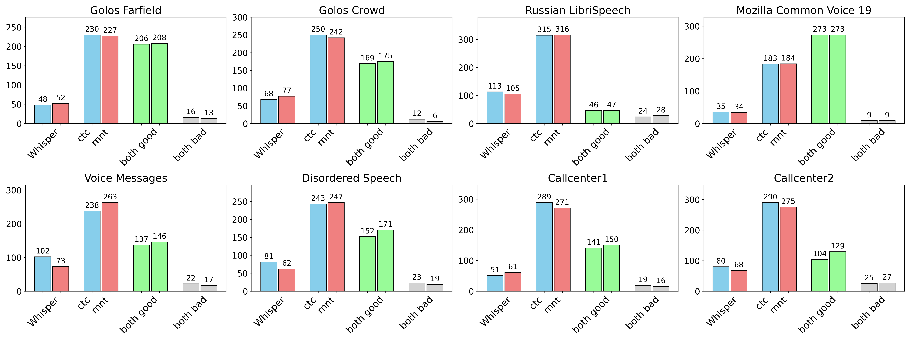

## ASR

Word Error Rate (%) across all validation sets for ASR models:


| Set Name                | V3 CTC | V3 RNNT | E2E CTC*| E2E RNNT*| V2 CTC | V2 RNNT | V1 CTC | V1 RNNT | T-One + LM | Whisper*|
|:------------------------|-------:|--------:|-----------:|------------:|-------:|--------:|-------:|--------:|-----------:|--------:|
| Golos Farfield          |    4.5 |     3.9 |        6.1 |         5.5 |    4.3 |     4.0 |    5.8 |     4.8 |       12.2 |    16.4 |
| Golos Crowd             |    2.8 |     2.4 |        9.7 |         9.1 |    2.5 |     2.3 |    3.1 |     2.3 |        5.7 |    19.0 |
| Russian LibriSpeech     |    4.7 |     4.4 |        6.4 |         6.4 |    5.2 |     5.2 |    7.5 |     7.7 |        6.2 |     9.4 |
| Mozilla Common Voice 19 |    1.3 |     0.9 |        3.2 |         3.0 |    1.5 |     0.9 |    8.4 |     8.0 |        5.2 |     5.5 |
| Natural Speech          |    7.8 |     6.9 |        9.6 |         8.5 |   10.8 |    10.3 |   12.6 |    11.4 |       14.5 |    13.4 |
| Disordered Speech       |   20.6 |    19.2 |       22.8 |        23.1 |   28.0 |    27.5 |   37.5 |    40.8 |       51.0 |    58.6 |
| Callcenter              |   10.3 |     9.5 |       13.3 |        12.6 |   13.6 |    12.9 |   15.5 |    15.0 |       13.5 |    23.1 |
| OpenSTT Phone Calls     |   18.6 |    17.4 |       20.0 |        19.1 |   20.7 |    19.8 |   23.0 |    21.1 |       19.8 |    27.4 |
| OpenSTT Youtube         |   11.6 |    10.6 |       12.7 |        11.8 |   13.9 |    13.0 |   16.0 |    14.7 |       21.9 |    17.8 |
| OpenSTT Audiobooks      |    8.7 |     8.2 |       10.3 |         9.3 |   10.8 |    10.3 |   12.7 |    11.7 |       13.4 |    14.3 |
| **Average**             | **9.1**| **8.3** |       12.0 |        11.2 |   11.1 |    10.6 |   14.2 |    13.8 |       16.3 |    21.0 |

\* with post-processing applied (removing punctuation and capitalization, replacing numerals, etc.)

## End-to-end ASR

Side-by-side (SBS) comparison of **v3_e2e_ctc** (blue) and **v3_e2e_rnnt** (red) against Whisper outputs across domains, using 500 random samples per test set. Each model was evaluated independently against Whisper by an LLM-as-a-Judge with randomized prompt ordering.



For the creation of training labels with punctuation and text normalization, we used [GigaChat Max Audio](https://habr.com/ru/companies/sberdevices/articles/904894/): this model was provided with both the original audio and transcription from the training corpus, alongside few-shot examples, to produce normalized text with precise punctuation. In contrast, using Whisper in forced decoding mode adds only punctuation (not normalization). Although this alternative reduces hallucinations, it results in especially poor comma accuracy, and training on such labels further degrades overall model performance.

|                                   | Normalization     |   F1(,) ↑ |   F1(.) ↑ |   F1(?) ↑ |   WER ↓ |   CER ↓ |
|:----------------------------------|:------------------|----------:|----------:|----------:|--------:|--------:|
| GigaChat Max Audio                | Full              |      84.2 |      85.6 |      74.9 |    18.4 |    10.9 |
| Whisper Punctuator                | punctuation only  |      62.2 |      85.0 |      77.7 |     0.0 |     0.0 |
| GigaAM from Whisper labels        | punctuation only  |      50.3 |      84.1 |      77.7 |    12.0 |     7.8 |
| GigaAM-e2e-ctc                    | Full              |      83.7 |      86.7 |      78.6 |    16.0 |     8.7 |
| GigaAM-e2e-rnnt                   | Full              |      84.5 |      86.7 |      79.8 |    14.2 |     8.8 |

## Emotion recognition

GigaAM-Emo was trained on the [Dusha](https://arxiv.org/pdf/2212.12266.pdf) dataset

|  |  | Crowd |  |  | Podcast |  |
| --- | --- | --- | --- | --- | --- | --- |
|  | Unweighted Accuracy | Weighted Accuracy | Macro F1-score | Unweighted Accuracy | Weighted Accuracy | Macro F1-score |
| [DUSHA](https://arxiv.org/pdf/2212.12266.pdf) baseline <br/> ([MobileNetV2](https://arxiv.org/abs/1801.04381) + [Self-Attention](https://arxiv.org/pdf/1805.08318.pdf)) | 0.83 | 0.76 | 0.77 | 0.89 | 0.53 | 0.54 |
| [АБК](https://aij.ru/archive?albumId=2&videoId=337) ([TIM-Net](https://arxiv.org/pdf/2211.08233.pdf)) | 0.84 | 0.77 | 0.78 | **0.90** | 0.50 | 0.55 |
| GigaAM-Emo | **0.90** | **0.87** | **0.84** | **0.90** | **0.76** | **0.67** |

## Attention type

We benchmarked attention implementations (one layer and full encoder) on CUDA. Custom implementation runs naive tensor multiplication. [SDPA](https://docs.pytorch.org/docs/stable/generated/torch.nn.functional.scaled_dot_product_attention.html) is enabled by default, as it offers better robustness across varying input dimensions. `flash_attn` is only beneficial for long sequences with `batch_size >> 1` ([example for `bs > 1`](./colab_example.ipynb)).

* Only Attention Mechanism (Time (ms) ± std)

| bs, seq_len |        Custom |        SDPA |        Flash |
|-------------|---------------|-------------|--------------|
| 1, 10s      | 0.03 ± 0.00   | 0.03 ± 0.00 | 0.05 ± 0.03  |
| 8, 20s      | 0.15 ± 0.01   | 0.14 ± 0.01 | 0.66 ± 0.14  |
| 128, 30s    | 3.60 ± 0.10   | 3.59 ± 0.04 | 1.40 ± 0.06  |

* Full Encoder Inference (Time (ms) ± std)

| bs, seq_len |        Custom |         SDPA |        Flash |
|-------------|---------------|--------------|--------------|
| 1, 10s      | 10.14 ± 0.17  | 10.06 ± 0.12 | 11.57 ± 0.25 |
| 8, 20s      | 15.84 ± 0.07  | 15.90 ± 0.02 | 25.26 ± 0.26 |
| 128, 30s    | 324.53 ± 0.17 | 324.48 ± 0.09| 293.80 ± 0.89|


## Test Coverage

We maintain high unit test coverage to ensure reliability and ease of refactoring. Coverage currently stands at 91%, measured with `pytest-cov` (`flash-attn` is not covered, as it requires GPU execution).

Command to reproduce (testing will take some time)
```bash
HF_TOKEN=<your hf token> pytest --cov=gigaam --cov-report=term-missing -v tests/
```
